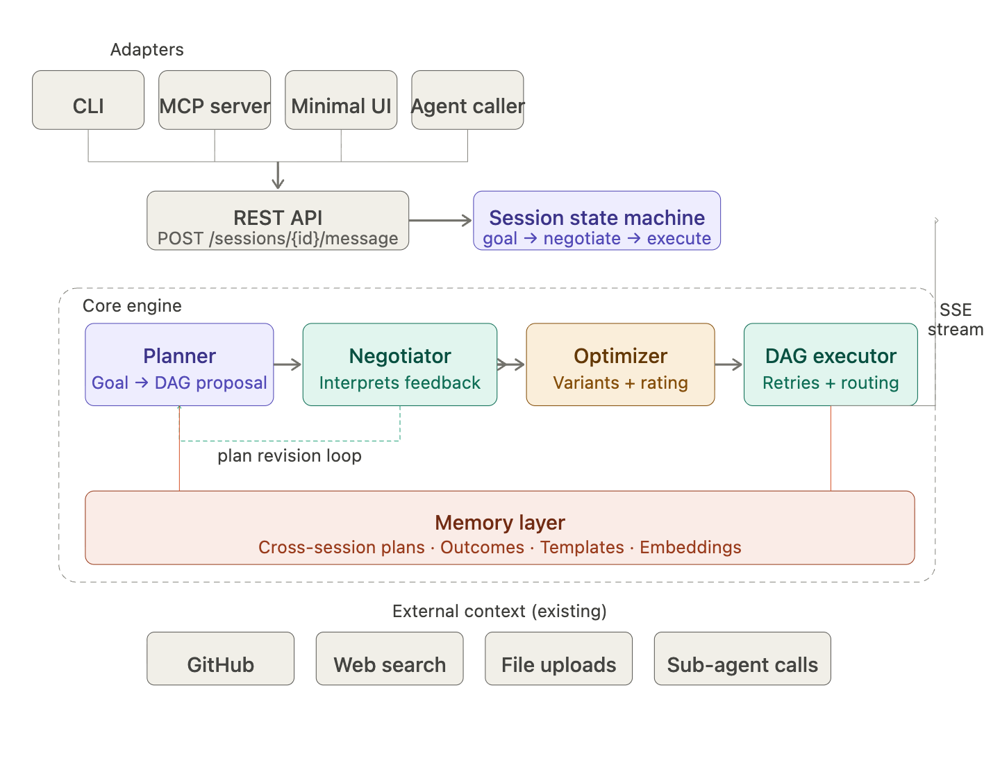
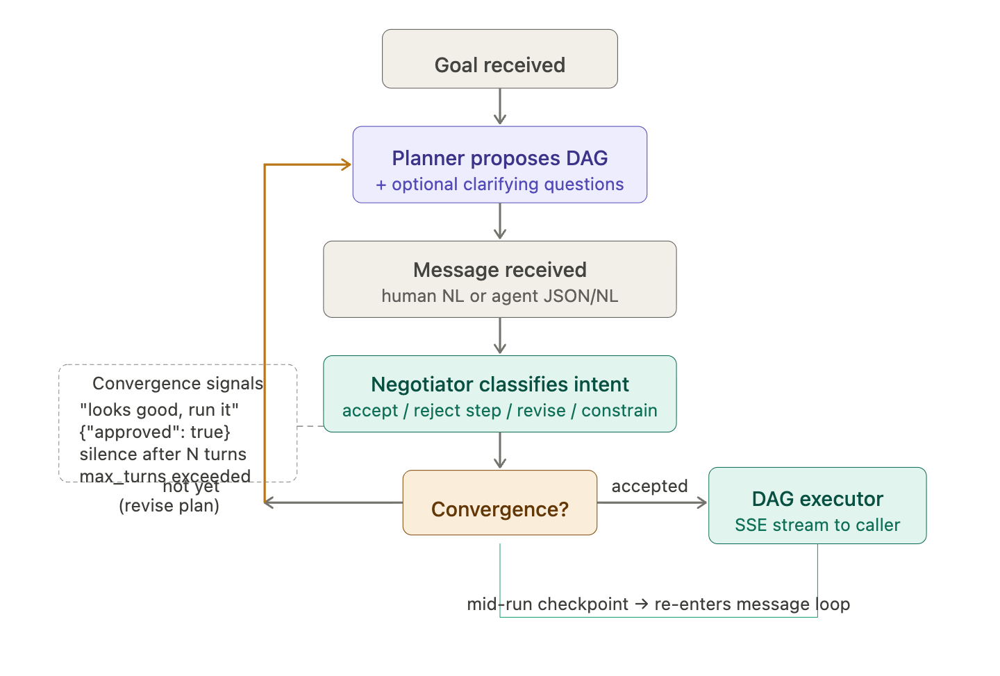

Good. This clarifies the redesign completely. With multi-agent orchestration as the primary target, the conversational feedback model becomes even more important — because the "human" in the loop might itself be another AI agent. The interface needs to be expressive enough for a language model to negotiate a plan, not just flip a boolean.

Here's how the pieces fit together in the rebuilt version:Perfect setup for a clean redesign. The multi-agent primary target is the key insight — it means the "feedback" API needs to be as natural for an LLM caller as for a human. A structured yes/no boolean can't carry the nuance either needs. Let me lay out the new architecture.

**The core conceptual shift:** instead of a plan lifecycle with discrete approval gates, you have a *negotiation session* — a stateful conversation where any participant (human, CLI, agent) can send a message, and a `Negotiator` component interprets intent from it: accept, reject step N, rewrite constraint, inject context, etc. The plan mutates in response, and the loop exits on detected convergence.




The `Negotiator` is the new component that makes this work. Here's how the conversation loop runs — note it's symmetrical whether the caller is a human or an agent:





Now the concrete implementation design — what to keep, what to cut, and what to build new:And the concrete API shape — this is the entire external surface of the rebuilt system:


```python
# The whole API, ~6 endpoints

POST   /sessions                    # create session, returns session_id
POST   /sessions/{id}/message       # universal input — handles goal, feedback, mid-run injection
GET    /sessions/{id}/state         # current plan DAG + conversation history + status
GET    /sessions/{id}/stream        # SSE: planning thoughts, execution step events, errors
POST   /sessions/{id}/execute       # trigger execution on the current approved plan
DELETE /sessions/{id}               # clean up

# For the MCP server adapter, these map directly to 4 tools:
# planweaver_create_session(goal, context?) → session_id
# planweaver_message(session_id, message)   → {plan, status, ready_to_execute}
# planweaver_execute(session_id)            → {execution_id}  
# planweaver_get_state(session_id)          → full state snapshot
```

The key design decision in `POST /sessions/{id}/message` is that it's *stateless from the caller's perspective* — you just send a string (or JSON). The session state machine on the server decides whether that message is a goal refinement, a plan negotiation turn, a mid-execution injection, or a post-execution rating. The caller — human or agent — doesn't need to know which stage they're at.

---

**What this rebuild actually involves effort-wise:** The Negotiator is the hardest new piece to get right, because it needs to reliably parse partial agreement ("step 3 is wrong but the rest is fine") and produce a clean plan mutation without re-running the whole planner. That's probably 2–3 weeks of prompt engineering and evals. Everything else — session state machine, memory layer, MCP adapter, minimal UI — is wiring. The React codebase going away is actually the biggest simplification in terms of maintenance surface. You drop the entire TypeScript build pipeline, Playwright tests, Vitest, and the frontend dependency tree. The replacement is ~200 lines of vanilla HTML/JS that can live in a single `static/` file served by FastAPI.

The existing Python backend is genuinely well-structured — `src/planweaver` stays, you're mostly adding the session orchestration layer on top of it, not rebuilding the planner or executor themselves.